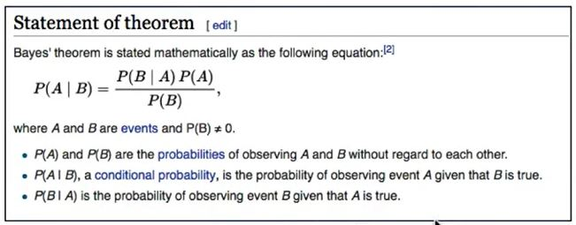

```{r echo=FALSE, warning=FALSE, message=FALSE}
if(!require(easypackages)){
    install.packages("easypackages")
    library(easypackages)
}
packages("dplyr", "ggplot2", prompt = FALSE)
```

## Introduction

Apache Spark 1.4 Build natively supports SparkR!

- Course requires AWS Account (created 7/7/17)
- Course recommends - https://community.cloud.databricks.com/


## Naive Bayes

One of the recent additions to SparkR is the Naive Bayes classification model. In simple terms, it creates a frequency table cataloging every possible value combination from your historical data for both positive and negative outcomes. Its simpler to visualize by thinking of simple categorical features, but it normally handles any data type. The Bayes theorem can then use the collected frequencies to yield new probabilities: 
 
```{r out.width = "500px", echo=FALSE}

```

Which states that:

- the probability of the outcome happening given certain values equals
- the probability for those values for that outcome multiplied
- by the probability for that outcome regardless of the values divided
- by probability for those values regardless of the outcome

If this isn’t clear, check out a brief and funny video from the folks at [RapidMiner](https://www.youtube.com/watch?v=IlVINQDk4o8).

It’s called ‘naive’ because it assumes independence between the predictors, but short of each predictor happening on a different planet, it is hard to know for sure. That said, such assumption simplifies the model tremendously; it makes the model simple, fast, and transparent. It is perfect for working with large data sets in distributed environments - perfect for Spark! 

### Titanic Dataset

Lets take a look at the Titanic example from Spark’s documentation using a built-in frequency table:
```{r eval=FALSE}
titanic <- as.data.frame(Titanic)
head(titanic)
```

Class    Sex   Age Survived Freq
1   1st   Male Child       No    0
2   2nd   Male Child       No    0
3   3rd   Male Child       No   35
4  Crew   Male Child       No    0
5   1st Female Child       No    0
6   2nd Female Child       No    0

```{r eval=FALSE}
tail(titanic)
```
   Class    Sex   Age Survived Freq
27   3rd   Male Adult      Yes   75
28  Crew   Male Adult      Yes  192
29   1st Female Adult      Yes  140
30   2nd Female Adult      Yes   80
31   3rd Female Adult      Yes   76
32  Crew Female Adult      Yes   20

We feed the data with 1 or more frequency counts in the spark.naiveBayes model:

```{r eval=FALSE}
titanicDF <- createDataFrame(titanic[titanic$Freq > 0, -5])
nbDF <- titanicDF
nbTestDF <- titanicDF
nbModel <- spark.naiveBayes(nbDF, Survived ~ Class + Sex + Age)
```

Let’s take a look at the summary output:

```{r eval=FALSE}
summary(nbModel)
```

(6) Spark Jobs
$apriori
           Yes        No
[1,] 0.5769231 0.4230769

$tables
    Class_3rd Class_1st Class_2nd Sex_Male Age_Adult
Yes 0.3125    0.3125    0.3125    0.5      0.5625   
No  0.4166667 0.25      0.25      0.5      0.75 

And let’s continue with the example and run the predictions:

```{r eval=FALSE}
nbPredictions <- predict(nbModel, nbTestDF)
showDF(nbPredictions)
```

(1) Spark Jobs
+-----+------+-----+--------+-----+--------------------+--------------------+----------+
|Class|   Sex|  Age|Survived|label|       rawPrediction|         probability|prediction|
+-----+------+-----+--------+-----+--------------------+--------------------+----------+
|  3rd|  Male|Child|      No|  1.0|[-3.9824097993521...|[0.60062402496099...|       Yes|
|  3rd|Female|Child|      No|  1.0|[-3.9824097993521...|[0.60062402496099...|       Yes|
|  1st|  Male|Adult|      No|  1.0|[-3.7310953710712...|[0.58003280993672...|       Yes|
|  2nd|  Male|Adult|      No|  1.0|[-3.7310953710712...|[0.58003280993672...|       Yes|
|  3rd|  Male|Adult|      No|  1.0|[-3.7310953710712...|[0.39192399049881...|        No|
| Crew|  Male|Adult|      No|  1.0|[-2.9426380107070...|[0.50318824507901...|       Yes|
|  1st|Female|Adult|      No|  1.0|[-3.7310953710712...|[0.58003280993672...|       Yes|
|  2nd|Female|Adult|      No|  1.0|[-3.7310953710712...|[0.58003280993672...|       Yes|
|  3rd|Female|Adult|      No|  1.0|[-3.7310953710712...|[0.39192399049881...|        No|
| Crew|Female|Adult|      No|  1.0|[-2.9426380107070...|[0.50318824507901...|       Yes|
|  1st|  Male|Child|     Yes|  0.0|[-3.9824097993521...|[0.76318223866790...|       Yes|
|  2nd|  Male|Child|     Yes|  0.0|[-3.9824097993521...|[0.76318223866790...|       Yes|
|  3rd|  Male|Child|     Yes|  0.0|[-3.9824097993521...|[0.60062402496099...|       Yes|
|  1st|Female|Child|     Yes|  0.0|[-3.9824097993521...|[0.76318223866790...|       Yes|
|  2nd|Female|Child|     Yes|  0.0|[-3.9824097993521...|[0.76318223866790...|       Yes|
|  3rd|Female|Child|     Yes|  0.0|[-3.9824097993521...|[0.60062402496099...|       Yes|
|  1st|  Male|Adult|     Yes|  0.0|[-3.7310953710712...|[0.58003280993672...|       Yes|
|  2nd|  Male|Adult|     Yes|  0.0|[-3.7310953710712...|[0.58003280993672...|       Yes|
|  3rd|  Male|Adult|     Yes|  0.0|[-3.7310953710712...|[0.39192399049881...|        No|
| Crew|  Male|Adult|     Yes|  0.0|[-2.9426380107070...|[0.50318824507901...|       Yes|
+-----+------+-----+--------+-----+--------------------+--------------------+----------+
only showing top 20 rows


### Golf & Weather Dataset

This is the classic Bayes data set - every example I encountered uses it! And here we go again: Golf|Weather Data Set from [Gerardnico](https://gerardnico.com/wiki/data_mining/weather):

```{r eval=FALSE}
golf_weather <- read.table(text = "Outlook  Temperature_Numeric Temperature_Nominal Humidity_Numeric    Humidity_Nominal    Windy   Play
                  overcast  83  hot 86  high    FALSE   yes
overcast    64  cool    65  normal  TRUE    yes
                  overcast  72  mild    90  high    TRUE    yes
                  overcast  81  hot 75  normal  FALSE   yes
                  rainy 70  mild    96  high    FALSE   yes
                  rainy 68  cool    80  normal  FALSE   yes
                  rainy 65  cool    70  normal  TRUE    no
                  rainy 75  mild    80  normal  FALSE   yes
                  rainy 71  mild    91  high    TRUE    no
                  sunny 85  hot 85  high    FALSE   no
                  sunny 80  hot 90  high    TRUE    no
                  sunny 72  mild    95  high    FALSE   no
                  sunny 69  cool    70  normal  FALSE   yes
                  sunny 75  mild    70  normal  TRUE    yes",header = TRUE,sep = "")

head(golf_weather)
```

##    Outlook Temperature_Numeric Temperature_Nominal Humidity_Numeric
## 1 overcast                  83                 hot               86
## 2 overcast                  64                cool               65
## 3 overcast                  72                mild               90
## 4 overcast                  81                 hot               75
## 5    rainy                  70                mild               96
## 6    rainy                  68                cool               80
##   Humidity_Nominal Windy Play
## 1             high FALSE  yes
## 2           normal  TRUE  yes
## 3             high  TRUE  yes
## 4           normal FALSE  yes
## 5             high FALSE  yes
## 6           normal FALSE  yes

As you can see with the data, there are two numeric fields. If we try to run it through the spark.naiveBayes model, it will fail and complain about continuous variables (Humidity_Numeric & Temperature_Numeric) not being supported (I imagine this will be fixed eventually, so if it works for you, be happy!):

```{r eval=FALSE}
golf_weather_sparkdf <-as.DataFrame(golf_weather)
golf_weather_model <- spark.naiveBayes(Play ~ ., data = golf_weather_sparkdf)
```

The good thing with this dataset is it includes binned features for the both Humidity_Numeric and Temperature_Numeric: Humidity_Nominal and Temperature_Nominal. Let’s remove them numeric features, split the dataset and train/validate it using Naive Bayes.

```{r eval=FALSE}
# remove the two features using dplyr's select command
library(dplyr)
golf_weather %>% dplyr::select(-Humidity_Numeric, -Temperature_Numeric) -> golf_weather
str(golf_weather)
```

'SparkDataFrame': 5 variables:
 $ Outlook            : chr "overcast" "overcast" "overcast" "rainy" "rainy" "rainy"
 $ Temperature_Nominal: chr "cool" "mild" "hot" "mild" "cool" "mild"
 $ Humidity_Nominal   : chr "normal" "high" "normal" "high" "normal" "high"
 $ Windy              : logi TRUE TRUE FALSE FALSE FALSE TRUE
 $ Play               : chr "yes" "yes" "yes" "yes" "yes" "no"

Split the data and run the model:

```{r eval=FALSE}
# cast into Spark dataframes
golf_weather_spark <-as.DataFrame(golf_weather)
 
golf_weather_model <- spark.naiveBayes(Play ~ ., data = golf_weather_spark)
summary(golf_weather_model)
```

$aapriori
       yes    no
[1,] 0.625 0.375

$tables
    Outlook_rainy Outlook_sunny Temperature_Nominal_mild
yes 0.3636364     0.2727273     0.4545455               
no  0.4285714     0.5714286     0.4285714               
    Temperature_Nominal_cool Humidity_Nominal_high Windy    
yes 0.3636364                0.3636364             0.3636364
no  0.2857143                0.7142857             0.5714286


How about feeding it some custom data to predict the probability of golfing - what if it is rainy, hot, normal humidity, and windy?

```{r eval=FALSE}
head(predict(golf_weather_model, as.DataFrame(data.frame(Outlook = c('rainy'), Temperature_Nominal=c('hot'), Humidity_Nominal=c('normal'),  Windy=c(TRUE)))),1)
```

Outlook Temperature_Nominal Humidity_Nominal Windy rawPrediction
1   rainy                 hot           normal  TRUE 
probability prediction
1         yes


What about if it is overcast, hot, high humidity, and windy?

```{r eval=FALSE}
head(predict(golf_weather_model, as.DataFrame(data.frame(Outlook = c('overcast'), Temperature_Nominal=c('hot'), Humidity_Nominal=c('high'),  Windy=c(TRUE)))),1)
```

Outlook Temperature_Nominal Humidity_Nominal Windy            rawPrediction
1 overcast                 hot             high  TRUE 
               probability prediction


### Wine Quality Data Set

A lot of Naive Bayes classification models in R can work with both categorical and continuous variables. These models know how to transform continuous variables in probabilities using functions such as the Probability Density Function (PDF).

Here is a look using function naiveBayes from the e1071 library and a bigger dataset to keep things interesting. We’ll use the UCI Machine Learning Repository’s Wine Quality Data Set. The data list various measurements for different wines along with a quality rating for each wine between 3 and 9. 

Let’s start by loading in and splitting the data:

```{r eval=FALSE}
winequality_red <- read.csv('http://mlr.cs.umass.edu/ml/machine-learning-databases/wine-quality/winequality-red.csv', sep = ';')

winequality_white <- read.csv('http://mlr.cs.umass.edu/ml/machine-learning-databases/wine-quality/winequality-white.csv', sep = ';')

# bind both data sets together
wine_quality <- rbind(winequality_red, winequality_white)

# replace period in column name with underscore
names(wine_quality) <- gsub(names(wine_quality), pattern = '\\.', replacement = '_')
#Spark and some models do not like periods

dim(wine_quality)
```

## [1] 6497   12

```{r eval=FALSE}
wine_quality$quality <- as.factor(wine_quality$quality)

# split it into two parts
set.seed(1234)
random_splits <- runif(nrow(wine_quality))
train_split_data <- wine_quality[random_splits < .5,]
validate_split_data <- wine_quality[random_splits >= .5,]
```

Now let’s run it through the e1071 naiveBayes model and take a look at what the model does with some continuous variables: 

```{r eval=FALSE}
#install.packages('e1071')
library(e1071)
wine_quality_model <- naiveBayes(quality ~ ., data = train_split_data)
```

If you feed your continuous variables directly into naiveBayes, it will use a Probability Density Function (PDF) to calculate likelihood and probabilities for that variable in relation to the outcome (it assumes your data is normally distributed).

Let’s take a closer look by focusing on one feature called alcohol. Alcohol is shown to be one of the more important features to predict quality. Here is a look at the transformation that takes place before feeding it through the PDF function:

```{r eval=FALSE}
head(wine_quality$alcohol)
```

## [1] 9.4 9.8 9.8 9.8 9.4 9.4

and after:

```{r eval=FALSE}
head(wine_quality_model$tables$alcohol)
```

##    alcohol
## Y        [,1]      [,2]
##   3 10.194118 1.2978206
##   4 10.076293 0.8842944
##   5  9.828416 0.8009873
##   6 10.588285 1.1324282
##   7 11.359167 1.2269708
##   8 11.570526 1.2773704

It then feeds the mean and standard deviation from continuous features along with the outcome variable in the distribution function to get the likelihood for the features and each outcome.

```{r eval=FALSE}
plot(wine_quality_model$tables$alcohol[,1])
abline(lm(wine_quality_model$tables$alcohol[,1] ~ seq(nrow(wine_quality_model$tables$alcohol))))
table(validate_split_data[,12])
```

## 
##    3    4    5    6    7    8    9 
##   13  100 1094 1419  539   98    3

```{r eval=FALSE}
table('predictied'=predict(wine_quality_model, validate_split_data[,-12]), 'actual'=validate_split_data[,12])
```
##           actual
## predictied   3   4   5   6   7   8   9
##          3   2   1  18  17   9   1   0
##          4   3   9  22  21   3   1   0
##          5   5  44 588 417  52  10   0
##          6   2  32 388 572 175  26   1
##          7   1  14  77 371 267  52   1
##          8   0   0   1  20  32   8   1
##          9   0   0   0   1   1   0   0

Unfortunately, the spark.naiveBayes currently only handles categorical variables so we’ll have to bin the variables manually and all the while in the SparkDataFrame format to preserve the ‘big data’, clustered advantage. 

For more information and updates on this topic, go to the source, the official help files: SparkR (R on Spark) - Naive Bayes Model

```{r eval=FALSE}
train_split_data_spark <- as.DataFrame(train_split_data)
validate_split_data_spark <- as.DataFrame(validate_split_data)

# make sql temp view 
createOrReplaceTempView(train_split_data_spark, "train_split_data_spark_table")
createOrReplaceTempView(validate_split_data_spark, "validate_split_data_spark_table")
```

To do the binning, we’ll use Spark SQL and the NTILE function:

```{r eval=FALSE}
collect(sql("SELECT alcohol, NTILE(4) OVER (ORDER BY alcohol) AS alcohol_quartiles FROM train_split_data_spark_table"))
```

       alcohol alcohol_quartiles
1     8.000000                 1
2     8.400000                 1
3     8.400000                 1
4     8.400000                 1
*** WARNING: skipped xxxx bytes of output ***

          4
3081 12.700000                 4
3082 12.700000                 4
3083 12.700000                 4
3084 12.700000                 4
3085 12.700000                 4

Apply NTILE to all continuous variables:

```{r eval=FALSE}
train_split_data_spark <- sql("SELECT 
case when NTILE(2) OVER (ORDER BY alcohol) = 1 then 'low' else 'high' end AS alcohol,
case when NTILE(2) OVER (ORDER BY fixed_acidity) = 1 then 'low' else 'high' end AS fixed_acidity,
case when NTILE(2) OVER (ORDER BY citric_acid) = 1 then 'low' else 'high' end AS citric_acid,
case when NTILE(2) OVER (ORDER BY residual_sugar) = 1 then 'low' else 'high' end AS residual_sugar,
case when NTILE(2) OVER (ORDER BY chlorides) = 1 then 'low' else 'high' end AS chlorides,
case when NTILE(2) OVER (ORDER BY free_sulfur_dioxide) = 1 then 'low' else 'high' end AS free_sulfur_dioxide,
case when NTILE(2) OVER (ORDER BY total_sulfur_dioxide) = 1 then 'low' else 'high' end AS total_sulfur_dioxide,
case when NTILE(2) OVER (ORDER BY pH) = 1 then 'low' else 'high' end AS pH,
case when NTILE(2) OVER (ORDER BY sulphates) = 1 then 'low' else 'high' end AS sulphates,
                              quality FROM train_split_data_spark_table")

validate_split_data_spark <- sql("SELECT 
case when NTILE(2) OVER (ORDER BY alcohol) = 1 then 'low' else 'high' end AS alcohol,
case when NTILE(2) OVER (ORDER BY fixed_acidity) = 1 then 'low' else 'high' end AS fixed_acidity,
case when NTILE(2) OVER (ORDER BY citric_acid) = 1 then 'low' else 'high' end AS citric_acid,
case when NTILE(2) OVER (ORDER BY residual_sugar) = 1 then 'low' else 'high' end AS residual_sugar,
case when NTILE(2) OVER (ORDER BY chlorides) = 1 then 'low' else 'high' end AS chlorides,
case when NTILE(2) OVER (ORDER BY free_sulfur_dioxide) = 1 then 'low' else 'high' end AS free_sulfur_dioxide,
case when NTILE(2) OVER (ORDER BY total_sulfur_dioxide) = 1 then 'low' else 'high' end AS total_sulfur_dioxide,
case when NTILE(2) OVER (ORDER BY pH) = 1 then 'low' else 'high' end AS pH,
case when NTILE(2) OVER (ORDER BY sulphates) = 1 then 'low' else 'high' end AS sulphates,
                              quality FROM validate_split_data_spark_table")
head(validate_split_data_spark)
```

 alcohol fixed_acidity citric_acid residual_sugar chlorides
1    high          high        high            low      high
2    high          high        high            low      high
3    high          high         low            low      high
4    high           low         low            low      high
5     low          high        high            low      high
6    high          high        high            low      high
  free_sulfur_dioxide total_sulfur_dioxide   pH sulphates quality
1                 low                  low  low      high       5
2                 low                  low  low      high       5
3                 low                  low high      high       6
4                 low                  low high      high       4
5                 low                  low  low      high       6
6                 low                  low  low      high       6


We’re finally ready to run the model and predict wine quality!!

```{r eval=FALSE}
wine_quality_model <- spark.naiveBayes(quality ~ ., data = train_split_data_spark) summary(wine_quality_model) 
```

$apriori
             6         5         7          4          8           3
[1,] 0.4379246 0.3227301 0.1670784 0.03613342 0.02964793 0.005558987
                9
[1,] 0.0009264978

$tables
  alcohol_low fixed_acidity_low citric_acid_low residual_sugar_low
6 0.4432699   0.5285412         0.4982382       0.4926004         
5 0.7571702   0.4521989         0.5353728       0.5047801         
7 0.1918819   0.5147601         0.4243542       0.5129151         
4 0.6271186   0.4661017         0.6016949       0.5423729         
8 0.1340206   0.5979381         0.4845361       0.4329897         
3 0.5263158   0.3684211         0.3684211       0.4736842         
9 0.25        0.25              0.25            0.75              
  chlorides_low free_sulfur_dioxide_low total_sulfur_dioxide_low pH_low   
6 0.5348837     0.491191                0.5193798                0.4827343
5 0.3565966     0.5248566               0.4464627                0.540153 
7 0.6568266     0.4520295               0.5350554                0.4741697
4 0.3983051     0.7711864               0.6271186                0.5      
8 0.7731959     0.2783505               0.443299                 0.4742268
3 0.5263158     0.6315789               0.5263158                0.5263158
9 0.75          0.5                     0.5                      0.25     
  sulphates_low
6 0.4876674    
5 0.5181644    
7 0.4538745    
4 0.6101695    
8 0.5979381    
3 0.5263158    
9 0.75     

Let’s check our predictions:

```{r eval=FALSE}
table(collect(validate_split_data_spark[,10]))
```

  3    4    5    6    7    8    9 
  13  100 1094 1419  539   98    3 

```{r eval=FALSE}
preds <- collect(select(predict(wine_quality_model, validate_split_data_spark[,-10]),'prediction'))
actual <- collect(validate_split_data_spark[,10])
table('predicted'=preds$prediction, 'actual'=actual$quality)
```

          actual
predicted   3   4   5   6   7   8   9
         5   5  27 416 552 205  34   1
         6   8  73 676 865 333  63   2
         7   0   0   2   2   1   1   0


